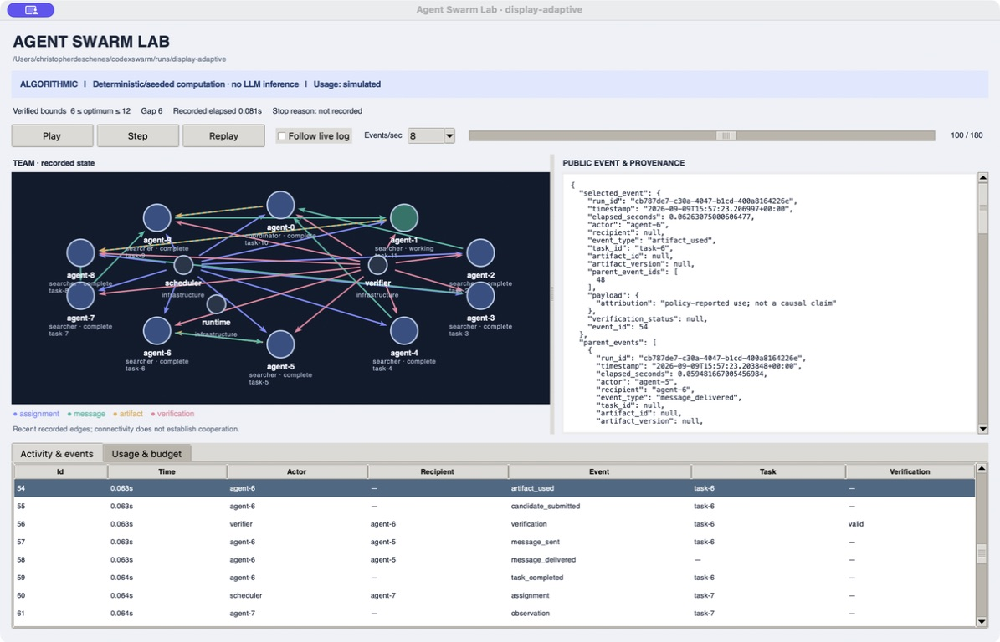

# Agent Swarm Lab

**Four Agents, One Checkable Problem: When Does Coordination Help?**

Current pilot version: **0.1.1**. See the [changelog](CHANGELOG.md) and [follow-on task prompt](docs/next-experiment-prompt.md).

An inspectable Python laboratory for testing multi-agent orchestration against a precisely checkable problem: find a largest subset of `{1, …, m}` with no three distinct members `a < b < c` such that `a + c = 2b`.

The offline runtime, validator, hidden exact evaluator, durable usage ledger, local desktop viewer, and tests are implemented. **Algorithmic runs use seeded search, not LLM reasoning.** Scripted runs are explicit protocol demonstrations. The opt-in live adapter completed a [three-call Terra pilot](docs/terra-pilot.md): 2,260 provider-reported tokens, USD 0.016160 calculated API cost, and a verified optimum at m=12. This is an integration check; comparative live coordination experiments remain future work.

## Offline quickstart

Python 3.11 or later. The runtime and tests use the standard library; no API key or package installation is needed from the checkout.

```sh
git clone https://github.com/Entrasoft/agent-swarm.git
cd agent-swarm
python3 -m venv .venv
. .venv/bin/activate
python -m unittest discover -s tests -v
python -m swarm_lab run --m 12 --agents 4 --condition independent --steps 24 --out runs/quickstart
python -m swarm_lab replay runs/quickstart --verify
```

Each run requires an empty output directory. Use a new directory for another run. `--steps` limits total team decisions, including coordinator decisions; `--agents` counts the coordinator when present. `m` is the mathematical universe size, independent of agent count.

Optional editable installation: `python -m pip install -e .` provides the `swarm-lab` command. It may need network access to install build tooling; the commands above do not.

## Display and experiments

```sh
python -m swarm_lab run --m 12 --agents 10 --condition adaptive --steps 48 --out runs/adaptive
python -m swarm_lab view runs/adaptive
python -m swarm_lab run --mode scripted --steps 8 --out runs/scripted
python -m swarm_lab benchmark --sizes 10,12,18,24 --seeds 0,1,2 --steps 48 --out runs/campaign
python -m swarm_lab oracle --m 24
```

The viewer is a **local Tk desktop application**, requiring a Python installation with Tk and a graphical session. It shows real recorded events and can follow an active run. Pause, step, scrub, or replay; inspect public payloads and provenance. No website is deployed. See [display instructions](docs/display.md).



Independent workers receive no peer findings or global incumbent. Fixed and adaptive teams each contain one coordinator and `N−1` searchers. Fixed routing is a coordinator star; adaptive algorithmic routing uses a disclosed heuristic. The deterministic scheduler and verifier do not count as agents. Scheduling is bounded and offline execution is reproducible for fixed settings; live completion order can vary.

The exact evaluator runs after workers stop, outside their observations. Candidate validation establishes a lower bound; only independent evaluation can tighten the upper bound. A run is marked solved only when those bounds meet. The deterministic solver is extremely fast on these small instances; this is an orchestration laboratory, not evidence that agents outperform ordinary algorithms.

## What is counted

Each attempted provider request has one durable SQLite ledger entry. Input/output totals include their cached/reasoning subsets; subsets are never added again. Estimates, provider-reported usage with calculated prices, and billing-reconciled charges remain separate. Missing usage is unknown and retains a conservative reservation. Retries share the run ceiling; duplicate telemetry does not duplicate spend. Request admission uses atomic token and decimal-currency reservations.

Offline accounting uses a frozen **simulated fixture**, dated 2026-09-09, with rates of $1 uncached input, $0.25 cached input and $2 output per million tokens. These are test rates, not provider prices. Offline runs have zero actual model calls and zero marginal model API spend; local compute still takes time. [The hand-auditable fixture](examples/usage-fixture.json) includes successful, retried and unresolved attempts.

Each run saves `config.json`, `events.jsonl`, SQLite stores, `summary.json`, `usage-ledger.json`, `usage-ledger.csv`, and `usage-summary.json`. Ledger exports include per-agent/purpose/model/call groups, latest cumulative accounting, raw usage metadata, frozen prices and correction records. Full generated runs are ignored by Git. The viewer's time curves use recorded usage events; ledger timelines explicitly represent latest accounting in dispatch order.

## Optional live provider

The adapter uses the [OpenAI Responses API](https://developers.openai.com/api/reference/python/resources/responses/methods/create), checked on 2026-09-09. It offers a narrow candidate/message schema, with no hosted tools or arbitrary code execution. Secrets come from `OPENAI_API_KEY` in the process environment or a protected local `.env`; credential contents and authorization headers are never recorded. Run `python3 -m swarm_lab.credentials setup` in an interactive Terminal to enter the key at a hidden prompt.

Live mode requires **all** of `--mode live`, `--allow-live`, `--model`, `--price-file`, `--token-limit`, and `--cost-limit`. There is no default live model. A nonsecret Terra price snapshot is supplied and must be reverified on the run date. See [Terra setup and the bounded pilot command](docs/live-provider.md) before an explicitly budgeted run. The owner's authorization for the completed pilot covered three calls, USD 2 and 100,000 total tokens; it does not extend to further runs.

## Evidence and design

- [Results and reproducible commands](docs/results.md)
- [Completed Terra pilot and public trace](docs/terra-pilot.md)
- [Authorized difficulty calibration protocol](docs/calibration-protocol.md)
- [Completed difficulty calibration and m=24 selection](docs/terra-calibration-results.md)
- [Approved four-condition live comparison protocol](docs/live-comparison-protocol.md) and [original proposal](docs/live-comparison-proposal.md)
- [Architecture](docs/architecture.md) and [predefined experiment protocol](docs/experiment-protocol.md)
- [Claims and evidence](docs/claims-evidence.md)
- [Article working draft](docs/article-draft.md) and [LinkedIn draft](docs/linkedin-draft.md), unpublished
- [Original handoff](docs/codex-swarm-lab-handoff.md), describing the broader intended project

Checkpoint/fork causal interventions and empirical claims of emergent or effective cooperation remain future work. The message-withholding prototype is not a causal experiment. See the protocol for the required leakage controls.

The separately approved solo difficulty calibration at m=18 and m=24 is complete: six calls, 10,395 tokens and USD 0.102580 calculated cost, with zero retries. m=18 was first-call optimal; m=24 retained a verified gap of two and was selected by the frozen rule. `python3 -m swarm_lab.calibration prepare` freezes a protocol and shared ledger without API requests; `execute --allow-live` is guarded against repeating this completed authorization.

The owner approved the m=24 comparison on 2026-09-09: five repetitions each of solo, independent, fixed and adaptive, with up to twelve total calls per run. Its separate ceilings are 240 calls, USD 20 and 2,000,000 tokens, preallocated as twenty equal twelve-call, USD 1 and 100,000-token allowances. Zero retries and a persistent execution claim prevent automatic repeat runs. Follow the [execution protocol](docs/live-comparison-protocol.md); an unknown charge or ambiguous dispatch halts the campaign. Preparation makes no API calls:

```sh
python3 -m swarm_lab.comparison prepare --price-file configs/gpt-5.6-terra-price.json --out runs/terra-comparison
```

## License

[MIT](LICENSE). Copyright © 2026 Christopher Deschenes.
