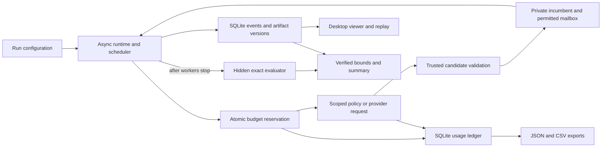

# Architecture

This repository is a small Python laboratory with a local Tk desktop viewer.
The runtime, search policies, hidden evaluator, event projection and usage ledger
are separate modules. The implementation uses the standard library; Tk support
depends on the installed Python distribution. It does not deploy a website.

The diagram describes implemented component boundaries. The hidden evaluator
has no path back to worker observations.

## Execution and state

[`runtime.py`](../swarm_lab/runtime.py) owns a run, an array of logical agent
states, bounded tasks and mailboxes, private feasible incumbents, counters, and
the semaphore that bounds active decisions. Agents are not separate processes.
N controls logical decision agents; concurrency independently controls in-flight
work. The coordinator, when present, counts toward N and the same run budget.

Each scheduled task grants one agent a lease for one decision, including its
bounded retries. A round schedules at most one task per agent and awaits the
group. Offline decisions have no suspension point, so they execute serially in
configured agent order and immediately deliver messages before the next agent's
observation. The nominal round is not an observation snapshot barrier. The
concurrency setting bounds overlapping live provider calls; their completion
order can depend on provider latency. Record these semantics when interpreting
communication comparisons. Protocol Amendment A discloses the correction to the
original scheduling description after initial outcome inspection.

A decision receives m, agent ID, role, local decision count, its private best
candidate, permitted mailbox, peer IDs, condition and task ID. Mailboxes have
entry and byte limits; oldest entries are removed from an oversized observation.
An observation contains no global incumbent, hidden upper bound, evaluator
candidate or general artifact-store query. The runtime records public action
payloads and observations for the experimenter, without requesting or storing
private chain of thought.

Three modes are explicit:

| Mode | Decision source | Accounting meaning |
| --- | --- | --- |
| scripted | Predetermined candidate fixture | Simulated usage; protocol/display check |
| algorithmic | Seeded randomized greedy construction and perturbation | Real local search, simulated model usage |
| live | Opt-in structured provider response | Actual requests; usage may be reported or unknown |

There is no automatic fallback from live to either offline mode. Offline
execution needs no credentials. API authentication reads the process environment or a permission-restricted,
Git-ignored local `.env` at provider initialization. Configuration snapshots do
not serialize credentials; local setup uses a hidden Terminal prompt.

## Roles, routing and validity

Solo uses one searcher. Independent uses N searchers with no information sharing.
Both fixed and adaptive use one coordinator plus N-1 searchers. Every offline
role constructs candidates; coordinator status changes routing. Fixed searchers
send to agent-0, and the coordinator rotates recipients. Adaptive heuristics
choose timing and one recipient from the allowed peers, responding to candidate
quality and unobserved peers. Roles remain assigned; workers do not invent or
switch roles in this implementation.

The action has a candidate, an optional message and used event IDs. The protocol
vocabulary includes request_help, propose_claim, submit_candidate,
challenge_claim, share_artifact and report_result; candidate submission is the
action's dedicated field. Recipient, size and condition checks occur before
delivery. Invalid candidate claims are rejected. The schema supports candidate
artifacts and assumptions, not general proof verification or arbitrary code.

[`math_task.py`](../swarm_lab/math_task.py) rejects noninteger members, booleans,
out-of-range values, duplicates and distinct three-term arithmetic progressions.
Geometric progressions are allowed. A valid candidate updates its owner's private
incumbent and the experimenter's lower bound. Global updates are invisible to
independent workers. The runtime also rejects their outbound messages, and their
allocator remains outcome-blind so assignments cannot encode other findings.

The exact evaluator uses deterministic include/exclude branch-and-bound. It
eliminates choices that complete forbidden triples and prunes when remaining
members cannot beat its incumbent. On timeout the unfinished frontier supplies
a sound upper bound. Its implementation is independent of the validator and is
cross-checked against exhaustive enumeration on tiny instances. Evaluation runs
after worker search; its candidate never replaces the workers' answer. Equality
of trusted U and worker L establishes solved status. Other runs retain a gap.

[`policies.py`](../swarm_lab/policies.py) also exposes a round-robin helper and an
experimental allocator balancing mean verified progress, exploration and mean
estimated cost. The primary campaign uses round robin. Allocation statistics
and costs must use consistent units. This dependent search environment carries
no classical bandit guarantee and implements no evolutionary population search.

## Durable evidence

[`store.py`](../swarm_lab/store.py) writes events and versioned candidate artifacts
to SQLite using WAL and full synchronization. Events carry run and event IDs,
timestamps and elapsed time, actor, recipient, type, task ID, artifact ID/version,
verification status, parents and public payload. SQLite is authoritative;
`events.jsonl` is a projection that can be regenerated after an interrupted append.
Configuration and summary JSON are replaced through temporary files.

Delivery IDs suppress duplicate deliveries during a run. Message-sent,
message-delivered, message-read and artifact-used events have different meanings.
The runtime accepts a reported use ID only if it was present in that decision's
mailbox. Use records provenance; it does not prove a causal improvement. Artifact
versions preserve the originating candidate submission and assumptions.

Persisted logs and the ledger survive reopening. Full resumption of an interrupted
agent run is not implemented: private RNG state, in-flight work and mailboxes
are not checkpointed for continuation. Existing output directories are protected
from accidental reuse; replay reads them without making provider calls.

Replay verification checks event order and parents, revalidates candidates,
reconstructs the worker lower bound, and checks evaluator/summary bounds, gap
and solved status. For completed evaluation records it recomputes the optimum
at the supported small sizes to reject a saved upper bound that is too low.
These are consistency and mathematical checks, not cryptographic log authentication.

## Budgets and provider boundary

[`ledger.py`](../swarm_lab/ledger.py) records one entry per attempted request,
keyed by attempt ID and linked to run, agent, task, logical call, attempt number,
purpose, requested model/tier, time and request ID when available. SQLite
transactions admit reservations atomically against the shared token and currency
ceilings. Reserving a new attempt includes estimated input and maximum output;
retries reserve separately. Coordinator work draws from the same ceiling.

Amounts use Decimal. Each run freezes a versioned price snapshot. Cached input
is a subset of input, and reasoning tokens are a subset of output; subset
counters are not added a second time. The supported pricing model uses disjoint
uncached-input, cached-input and output buckets. Missing cache breakdown is
explicitly labeled and priced as uncached; missing total usage remains unknown.
The adapter does not enable hosted tools, batch pricing, cache-storage charges
or additional billing schemes that lack an implemented reservation model.

The ledger distinguishes pre-call estimates, observed provider usage with
calculated cost, and reconciled billed charges. Duplicate telemetry cannot add
spend; explicit corrections and reconciliation retain audit records. Ambiguous
timeouts and missing usage retain conservative commitments. Restarting the
ledger does not erase pending reservations. It exports JSON and CSV entries,
group totals and a cumulative usage/cost timeline.

[`providers.py`](../swarm_lab/providers.py) makes a single bounded structured
Responses request through urllib, with no SDK retries or model-accessible host
tools. The runtime owns retry limits and all accounting. Unknown transport
outcomes stay potentially chargeable. Python cancellation cannot retract
provider activity; actual usage exceeding reservations is reported as overshoot.
Live configuration requires an explicit model, positive ceilings, same-day
official price verification and an opt-in flag. The provider's existence is not
evidence that a paid run has been performed or that every model accepts this
schema. See the results record for what was actually exercised.

## Display and experiment boundaries

[`display.py`](../swarm_lab/display.py) folds saved events into graph, task/state,
bound, timeline and usage views. The Tk interface reads the same projection for
saved replay and refreshing an active run. It shows distinct edge categories,
stable agent positions, event payload/provenance inspection, and pause/step/play
controls. Pausing the viewer pauses playback; it does not suspend live provider
work. Replay and headless checks do not make model calls.

The withholding option is a diagnostic filter for a numbered message and repeated
identical content. It does not suppress every paraphrase or causal descendant,
restore a checkpoint, or establish causal message value. A leakage-controlled
checkpoint/fork design is specified in the experiment protocol as future work.

The initial scope excludes arbitrary agent code execution, dynamically created
roles or tasks, general theorem checking, restored agent runs, billing ingestion,
and a completed live causal experiment. These boundaries keep the current
observations interpretable.
