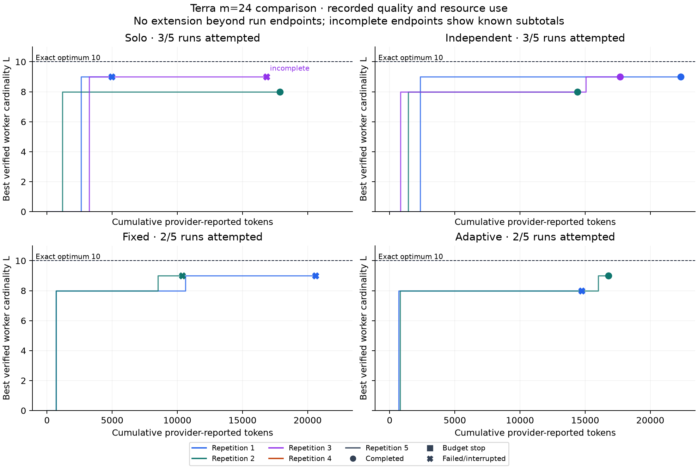
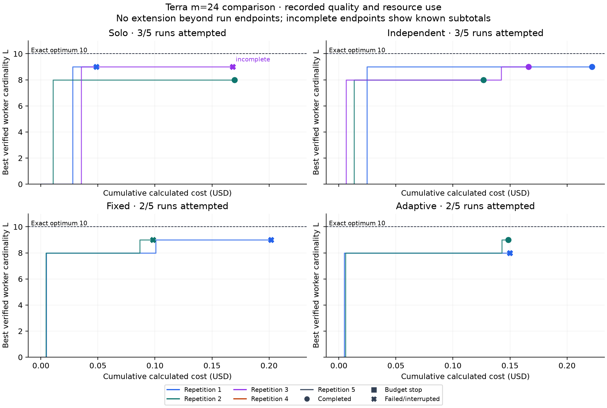

# Four Agents, One Checkable Problem: What Two Interrupted Studies Revealed

**Unpublished article draft. Updated 2026-09-10 with the separately authorized feedback follow-up; requires author review before posting.**

The first experiment stopped before answering its central question.

Agent Swarm was built to compare one model-driven worker with small teams, then ask whether communication improved a verified answer enough to justify its cost. Twenty runs were planned. Ten started. After 95 request attempts, a transport failure left one request's usage unknown, and the campaign stopped under its declared protocol.

None of the ten started runs found the optimum. The 94 responses with known usage accounted for 156,639 tokens and USD 1.499658 calculated cost. The final request remains unresolved, so the campaign has no complete cost total.

A smaller follow-up then tested a worker's own attempt history and validation feedback. It also halted, after 32 attempts. The sole observed treatment repeated one valid set; both observed baseline runs improved from eight members to nine.

These interrupted studies leave inspectable evidence about repetition, information boundaries and reliability. They establish neither a swarm advantage nor a harmful effect of feedback. Both campaigns have separate protocols and budgets. [Coordination comparison](live-comparison-results.md), [feedback follow-up](feedback-v02-results.md)

## A familiar coordination problem

Task assignment and communication have a long engineering history. Reid G. Smith's 1980 Contract Net paper described distributed problem solving through task announcements, bids and awards. This laboratory does not reproduce that protocol, but its questions remain recognizable: who owns work, what information travels, and how much coordination costs. [Smith's paper](https://www.reidgsmith.com/The_Contract_Net_Protocol_Dec-1980.pdf)

Here, a language model fills a narrow decision slot. It receives a scoped observation and returns a candidate plus an optional message. Deterministic code controls delivery, validation, scheduling and spending. A persuasive answer cannot redefine success or authorize another request.

An agent is a stateful decision unit. Each decision is a fresh Responses request; in the first comparison, persistent state consisted of that worker's best candidate and a bounded mailbox. The system does not preserve a full conversation transcript. Four agents therefore means four separate states, not necessarily four processes or four different models. Separate contexts also do not imply statistically independent reasoning.

## A problem with an independent answer

Choose an integer m and find the largest subset of {1, …, m} containing no three distinct numbers a < b < c satisfying a + c = 2b. The set {1, 2, 4} is valid. The set {1, 2, 3} is invalid because it contains an arithmetic progression.

A validator rejects duplicates, out-of-range values and forbidden triples. A valid candidate with L members establishes a lower bound. It does not prove that a larger candidate is impossible.

A separate exact evaluator supplies the upper bound U. Equality U=L establishes solved status. The evaluator runs after the worker phase, and its answer never enters a worker observation. Its candidate is never credited to a model.

For the selected instance, m=24, the optimum is ten. Across the ten started runs, the exact evaluator's median recorded time was approximately 8.47 milliseconds. The median worker phase was approximately 190 seconds, including stopped runs and API waiting. These host-specific measurements make the conventional baseline clear: the deterministic solver handles this task easily.

The study examines model coordination under constrained observations. It does not demonstrate new mathematics or an advantage over a suitable exact algorithm. Possible familiarity with this tiny problem remains another limitation.

## Why this instance was selected

An initial live pilot at m=12 found the optimum of six on its first call and repeated it twice. Three calls used 2,260 tokens and USD 0.016160 calculated cost. That checked the integration, while leaving little room for a team to improve quality.

A separately authorized calibration used three solo decisions each at m=18 and m=24. The first m=18 candidate reached its optimum of eight. All three m=24 candidates had eight members against an optimum of ten. A rule declared before calibration therefore selected m=24 for the comparison. Those six calls used 10,395 tokens and USD 0.102580 calculated cost. [Calibration record](terra-calibration-results.md)

Neither stage contributes observations to the comparison. Selection demonstrated headroom in one trace.

Earlier offline runs exercised the runtime with real local search and simulated model accounting. Their quality pattern showed no coordination advantage. Review also found that an original scheduling description did not match the implementation. The repository preserves the correction and identifies the later reporting rerun as validation after inspection. That history is separate from the live campaign. [Offline record](results.md)

## Four configurations, explicit boundaries

Each run received ceilings of twelve decision calls, 100,000 tokens and USD 1:

| Configuration | Decision agents | Permitted communication |
| --- | --- | --- |
| Solo | One searcher | None |
| Independent | Four searchers | None |
| Fixed | One coordinator and three searchers | Through the coordinator |
| Adaptive | One coordinator and three searchers | Each agent may choose another peer |

The coordinator counts toward the four-agent roster and pays for its calls. It can submit candidates under the same task prompt; its role is not exclusively managerial. With twelve completed calls, each team member receives three opportunities, while the solo state receives twelve.

Every configuration used gpt-5.6-terra with medium reasoning, the default service tier, a 25,000-token maximum output allowance including reasoning, a 120-second timeout and zero retries. Concurrency was one. Within a team, dispatch followed agent order, allowing a later agent to see a message delivered earlier in the round.

Each run began with empty private state. Independent workers received no common incumbent, peer result or summary, and their scheduling did not react to others' success. Fixed and adaptive used the same role composition and call allocation. Fixed routing allowed the coordinator to choose a searcher recipient; adaptive permitted additional routes.

The independent-versus-coordinated contrast changes both communication and role composition. Fixed-versus-adaptive compares routing permission more closely, but still cannot isolate the value of one message.

Five repetition blocks produced twenty planned rows. Condition order was randomized within each block and frozen before inference with the protocol, configurations and source hashes. Recorded seeds identify runs; they do not control provider sampling. Candidate quality did not trigger early stopping.

## The missing half stays visible

Only five runs completed all twelve calls. Three other runs ended on invalid mathematical candidates. A fourth stopped when the adapter labeled its response `invalid_action`. That response's usage was available, but its undecoded public output was not retained, so the underlying response problem cannot be diagnosed from the saved evidence.

The third solo run then encountered `transport_unknown` on its tenth request, attempt 95 overall. The adapter does not distinguish a timeout from another network failure in that outcome. No request ID or usage was available. Under the protocol, that ambiguity halted the entire campaign.

The table retains every planned run. Numbers are best independently valid candidate sizes; the exact optimum is ten throughout the started sample.

| Repetition | Solo | Independent | Fixed | Adaptive |
| --- | --- | --- | --- | --- |
| 1 | 9; failed | 9; completed | 9; failed | 8; failed |
| 2 | 8; completed | 8; completed | 9; failed | 9; completed |
| 3 | 9; interrupted | 9; completed | Unstarted | Unstarted |
| 4 | Unstarted | Unstarted | Unstarted | Unstarted |
| 5 | Unstarted | Unstarted | Unstarted | Unstarted |

All ten started runs retain measurable quality despite their different stopping states. Seven finished with a best candidate of nine members, three with eight. None reached ten. Solved/attempted counts are 0/3 for solo, 0/3 for independent, 0/2 for fixed and 0/2 for adaptive. Unstarted rows have no quality value.

Fixed reached nine in both observed runs; adaptive reached eight and nine. Both fixed runs failed, while one adaptive run completed. Independent and solo also each produced eight- and nine-member outcomes. These small, uneven, interrupted samples support no reliable ranking of the configurations.

Duplicate work was visible too. The second solo and independent runs each made twelve decisions without improving beyond eight; each recorded eleven duplicate candidates. Additional opportunities did not improve those particular traces.

## What the ledger can actually say

The authorized stage had aggregate ceilings of 240 attempts, two million tokens and USD 20. Every comparison request, including failed and coordinator requests, shared those limits. Earlier pilots, Codex-assisted development and local compute are outside the reported comparison API spending.

Before dispatch, the ledger reserved a conservative input estimate and maximum output headroom against both the run and campaign allowances. Reported usage released unused capacity. Underspend was not transferred between conditions. A known failure ended its run without replacement calls; ambiguous usage required the campaign stop.

| Configuration | Attempts | Known tokens | Known calculated USD |
| --- | ---: | ---: | ---: |
| Solo | 25 | 39,706† | 0.386382† |
| Independent | 36 | 54,437 | 0.514824 |
| Fixed | 16 | 30,968 | 0.299966 |
| Adaptive | 18 | 31,528 | 0.298486 |
| **Campaign** | **95** | **156,639**† | **1.499658**† |

The dagger (†) marks an incomplete subtotal: one solo request has unknown usage. Its reservation remains 28,075 tokens and USD 0.3076875. Known use plus that reservation gives committed accounting of 184,714 tokens and USD 1.8073455. A reservation is not a measured charge, and it does not establish the provider's final bill.

No budget overshoot or retry was recorded. No run stopped for budget exhaustion. The campaign stopped because accounting became uncertain, despite substantial unused allowances.

The 94 known responses reported 38,001 input and 118,638 output tokens, including 112,695 reasoning tokens within output. Cache reads and writes were explicitly zero. The price snapshot, verified and frozen on September 9, 2026, priced ordinary input at USD 2 and output at USD 12 per million tokens. Those totals produce the USD 1.499658 known subtotal. All billing remains unreconciled. [Frozen price snapshot](../configs/gpt-5.6-terra-price.json)

Ten coordinator-purpose calls account for 9,219 known tokens and USD 0.054538, already included above. Messages carried in searcher inputs also consume tokens; their exact individual contribution is not separately measured. Local delivery does not itself create another API request.

Cost per solution is undefined because no run solved. The campaign's overall efficiency calculation is additionally incomplete because one charge is unresolved.

The curves use saved verification events and accounting. Endpoints retain known failure costs; the interrupted endpoint contains only a known subtotal. Stopped curves are not extended into hypothetical later decisions.

## A message can travel without improving the answer

The annotated example follows a reproducible rule: the earliest adaptive run with a delivered message, its first delivery, and the receiver's first observation and valid candidate in that task.

In `r01-adaptive`, event 9 delivered the coordinator's eight-member candidate to agent 1 with a request for help. Event 13 shows that exact message in the receiver's observation. The receiver reported using it, recorded by event 16, and event 18 validated the same eight-member set. Across those first two requests, the team used 5,355 tokens and USD 0.056020 calculated cost. Its best candidate remained eight. [Annotated public trace](../examples/terra-comparison/report/trace-annotations.md)

That sequence establishes delivery, visibility and reported use. It does not establish that the message caused the repeated answer or prevented an improvement. The run later failed on an invalid candidate, and that outcome stays attached to the example. At event 62, the proposed set included 16, 19 and 22. Those three numbers form an arithmetic progression, so the verifier rejected the candidate and retained the earlier valid result.

Across the started coordinated runs, 27 messages were delivered and 20 provenance events recorded policy-reported reuse. Neither count demonstrates beneficial cooperation. A stronger test would restore a checkpoint and compare continuations with and without selected information, preventing leakage through other messages or artifacts. The repository does not implement that complete intervention; its diagnostic withholding filter is insufficient for a causal claim.

## A smaller follow-up tested the search loop

The first comparison recorded 74 duplicates among 90 valid submissions. Workers retained a private best but no attempt history or explicit validation feedback. Before testing peer influence, the next study asked whether a solo worker could use a bounded record of its own attempts to make progress.

Version 0.2 added sanitized failure diagnostics and offline tests for history isolation, validation, stopping and accounting. A separately approved pilot compared private-best-only observations with observations containing up to eight prior attempts and validator feedback, keeping other settings equal. Memory and feedback were a combined intervention; their individual effects were not isolated.

Both arms now consumed a scheduled decision on invalid mathematics and could continue to the next admissible request. Malformed or prohibited actions still stopped the run. Three paired blocks froze six solo runs, each limited to twelve attempts, 100,000 tokens and USD 1; aggregate ceilings were 72 attempts, 600,000 tokens and USD 6. Earlier runs were not added to this new control sample.

The primary outcome was distinct valid candidate sets across each run. Best size was reported alongside diversity. These are all six planned rows:

| Block | Arm | Attempts | Distinct valid sets | Best size | Status |
| --- | --- | ---: | ---: | ---: | --- |
| 1 | History and feedback | 9 | 1 | 8 | Protocol failure |
| 1 | Private best only | 12 | 2 | 9 | Completed |
| 2 | Private best only | 11 | 2 | 9 | Interrupted |
| 2 | History and feedback | — | — | — | Unstarted |
| 3 | History and feedback | — | — | — | Unstarted |
| 3 | Private best only | — | — | — | Unstarted |

The treatment submitted the same eight-member set eight times. Its observations contained prior repetitions, yet no verified improvement followed. The predeclared qualification criterion—progress after seeing a prior invalid or repeated attempt—was therefore unmet. In the only block with both arms observed, treatment minus baseline was −1 distinct valid set, with different stopping states. This single pair cannot establish that feedback harmed performance.

Both baseline runs improved from eight to nine. Three invalid mathematical submissions occurred in those baseline traces, and subsequent decisions proceeded under the new rule. Treatment correction after invalid mathematics was not exercised live. Its ninth response failed the local action contract; the log retained a generic reason, so the offending field cannot be identified.

Attempt 32 ended in a client-side transport timeout with no response headers received. Diagnostics retained a client correlation ID; no provider request ID or usage was available. That narrows the observed failure category, without identifying its underlying cause, whether the provider executed the request, or its charge. Unknown accounting again halted the campaign.

The 31 known attempts used 65,225 tokens and USD 0.644390 calculated cost. A further 28,077 tokens and USD 0.3076925 remain reserved. Complete cost is unknown; billing is unreconciled. These figures belong solely to v0.2 and do not settle the first campaign's unresolved request. [Follow-up report and traces](feedback-v02-results.md)

The next work is to review the unsuccessful search loop offline, investigate the request timeout and retain specific, sanitized local contract-failure categories. The deterministic evaluator remained a millisecond-scale baseline. More paid sampling would need a new proposal; neither campaign's missing rows will be silently filled.

The MIT-licensed repository preserves [the first executed source](https://github.com/Entrasoft/agent-swarm/commit/4a30a2519491f355c60bcaa19799ab14010e71ab), [the v0.2 source](https://github.com/Entrasoft/agent-swarm/commit/d86c9c38ba0d8a283423087f13fe148d88253b94) and both evidence packages. Readers can replay candidates, history and accounting without another model request. The coordination question remains open.
