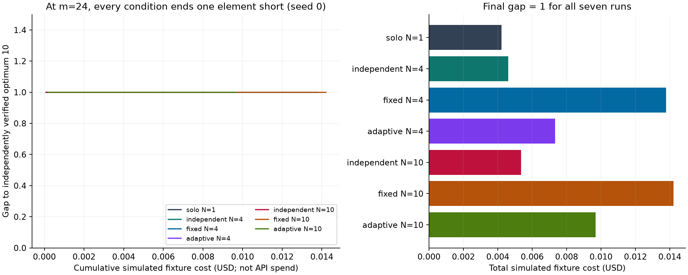
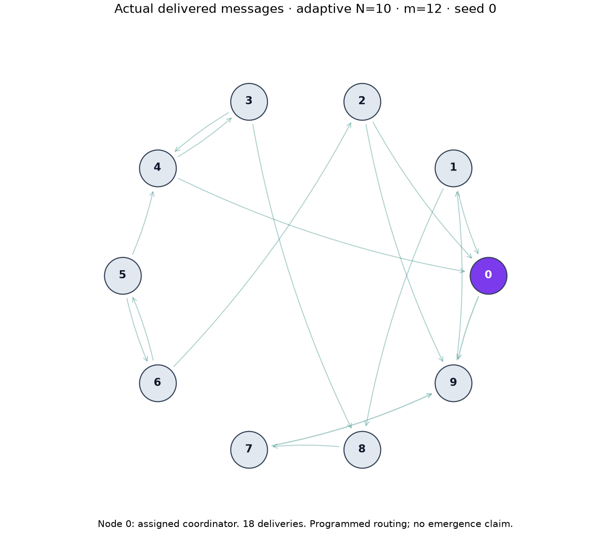

# Offline results — 2026-09-09

The 84-run algorithmic campaign found no final-quality advantage from coordination at the tested decision ceiling. All 63 runs at m=10,12,18 reached the independently verified optimum. All 21 runs at m=24 found a valid set of size 9 while the exact evaluator proved optimum 10. There were no execution failures; the 21 unsuccessful searches are retained in the results and accounting.

These are deterministic/seeded algorithmic workers, not LLMs. No live calls or paid inference occurred. The exact solver was much faster than the instrumented worker runs on these instances.

## What ran

Each campaign used 4 problem sizes × 3 seeds × 7 conditions = 84 runs, with 48 total decision opportunities per run. There were 4,032 completed decisions. Conditions: solo N=1; independent, fixed and adaptive at N=4 and N=10. Coordinator decisions count within N and the team budget. Full settings are frozen in the [published manifest](../examples/offline-campaign/results.json).

| Universe m | Exact optimum | Solved / attempted | Worker final gap, all seven conditions | Exact baseline time on this machine |
| --- | ---: | ---: | ---: | ---: |
| 10 | 5 | 21 / 21 | 0 | 0.053 ms |
| 12 | 6 | 21 / 21 | 0 | 0.075 ms |
| 18 | 8 | 21 / 21 | 0 | 0.838 ms |
| 24 | 10 | 0 / 21 | 1 | 4.976 ms |

Instrumented worker phases took approximately 0.34–0.49 seconds per run. That includes repeated durable event/ledger writes and exports, so it is not pure search time. Oracle time and validator time are separately recorded. The single deterministic baseline measurement per m is illustrative; it is not a latency distribution or a significance test.

Per-seed rows, condition medians, candidate sizes, stopping reasons, message counts, duplicate submissions and artifact reuse are available as [JSON](../examples/offline-campaign/results.json) and [CSV](../examples/offline-campaign/results.csv). Three seeds do not support broad statistical conclusions. Fixed/adaptive routing changes recipient selection and timing together, and roles are assigned rather than discovered.

## What the accounting says

Across all 84 final runs, including the 21 unsolved runs:

- **497,312 simulated input-plus-output tokens**; subsets are not added again.
- **USD 0.670441 simulated fixture cost**, using offline-v1 test rates dated 2026-09-09.
- Simulated cost per verified solution: approximately **USD 0.010642** (all-run spend / 63 successes).
- Approximately **19.50%** of simulated cost is attributed to coordinator-purpose calls; **0%** to retries in this campaign. Peer-message context inside searcher calls is included in their estimated input, but is not separately measured by a provider.
- **Zero actual model calls and zero marginal model API spend.** Local computation, storage and electricity are outside that API number.

This does not establish model token efficiency. Simulation uses approximate string-length accounting and invented fixture rates; live provider tokenization, prices and billing remain untested. The exact rates and hand calculation are in [the accounting fixture](../examples/usage-fixture.json). Separate tests cover unresolved charges and retry attribution even though the successful offline campaign had neither.

At m=24 there are **no verified successes**, so cost per verified solution for that stratum is undefined, not zero. The machine-readable report includes total campaign cost and the complete attempt denominator. Price snapshots never update historical run calculations silently.



The curves coincide at a gap of one for this seed. The companion bars expose the different simulated accounting totals. This chart uses the evaluator's optimum only after each run; workers never saw it.



This graph is generated from actual delivery events for m=12, N=10, adaptive, seed 0. Connectivity is not evidence of effective cooperation. The [desktop screenshot](images/display.jpg) shows a separate 24-decision adaptive demonstration paused at event 100 of 180; its displayed upper bound is the value known at that replay point.

## Reproducibility and protocol correction

The original protocol was committed as `97aae3a` before inspecting comparative results. The initial campaign used implementation revision `ac42250`. Review then found that the protocol's description of within-round message availability implied batch snapshots. The offline code actually executes each decision serially and delivers its messages before the next decision. [Amendment A](experiment-protocol.md#amendment-a--scheduling-clarification-after-initial-outcome-inspection) preserves the original text and discloses this discrepancy after outcome inspection.

After failure-accounting, input-validation, provenance and replay checks were strengthened, the matrix was rerun from source revision **`aecaa7b`**. It produced identical per-run final gaps. This final run is a validation repeat after outcomes were known, not an independent preregistered replication. No solver, candidate-search or routing policy was tuned to improve the observed results. Do not pool the two 84-run campaigns as 168 independent samples.

All final-run module hashes are recorded in each configuration and match across the 84 runs. Sixteen configurations have a dirty-tree marker because documentation/example exports were being prepared; the recorded module hashes establish that their Python source was identical. The compact report identifies the platform and Python version.

[The compressed raw event archive](../examples/offline-campaign/events.jsonl.gz) contains every original public event from the final campaign, grouped by run ID. Its SHA-256 is in the manifest. Each run_started event retains configuration and source hashes; each run_finished event retains its full summary. Full SQLite stores, per-attempt JSON/CSV ledgers and both campaign directories remain in the ignored local `runs/` folder. The public archive is approximately megabyte scale rather than committing all generated databases.

Reproduce from the repository root, using new empty output directories:

```sh
python3 -m unittest discover -s tests -v
python3 -m swarm_lab benchmark --sizes 10,12,18,24 --seeds 0,1,2 --steps 48 --out runs/reproduction
python3 -m swarm_lab replay examples/algorithmic --verify
python3 -m swarm_lab replay examples/scripted --verify
python3 -m swarm_lab view examples/algorithmic
```

Optional figure regeneration needs Matplotlib in a separate authoring environment (the implementation used Matplotlib 3.11.1):

```sh
python3 -m venv .venv-figures
. .venv-figures/bin/activate
python -m pip install matplotlib==3.11.1
python scripts/report_campaign.py runs/reproduction --out runs/reproduction-report
```

The report script also regenerates the two PNG figures under `docs/images/`. It does not alter input run data. Event IDs, candidate outcomes and usage are replayable; timestamps and OS timing will differ across machines.

## Validation and next experiment

The implementation passes **63 tests**, including exhaustive oracle cross-checks at m=0..12, visibility separation, invalid claims, decimal price arithmetic, token subsets, concurrent reservations, missing usage, duplicate telemetry, retry attribution, restart recovery, sibling failure settlement, replay upper-bound checks and display projections. The offline quickstart and scripted replay were executed in a fresh Python 3.12 virtual environment without runtime packages. The actual Tk window was rendered, replayed and visually checked; it requires a graphical session and a Python build with Tk.

The live adapter has mocked request/response tests only. The next proposed paid step is a three-decision solo pilot with an explicitly chosen model, same-day verified prices, no automatic retries, and an owner-approved total token/currency ceiling. See [live provider instructions](live-provider.md). No paid amount has been authorized.

Current instances are trivial for the exact solver. Before claiming agent benefit, profile a disclosed larger or held-out task extension, revalidate its ground truth, and predefine a separate controlled experiment. Full checkpoint/fork interventions, resume of active workers and causal message attribution remain unimplemented. A message-withholding filter alone does not support causal claims.
